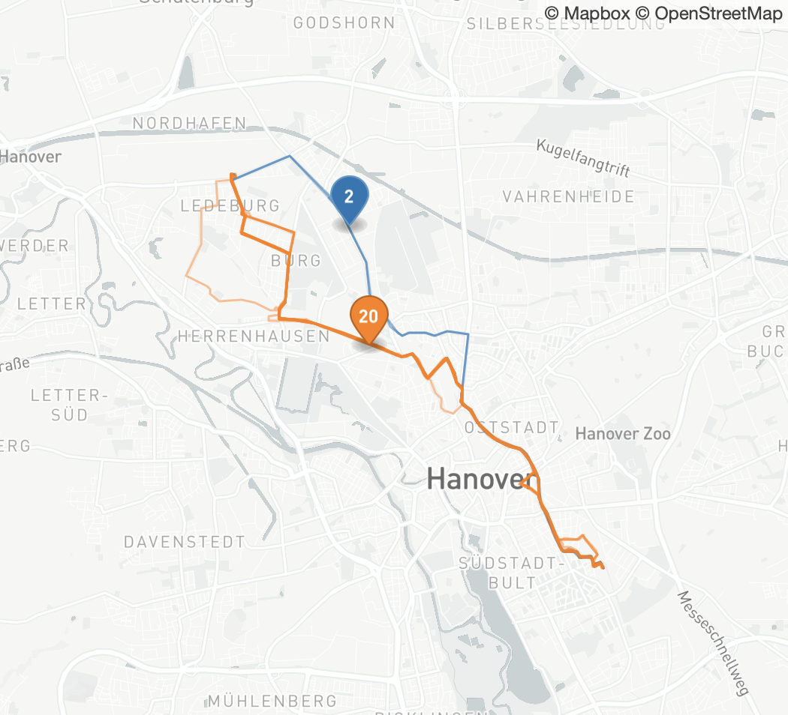
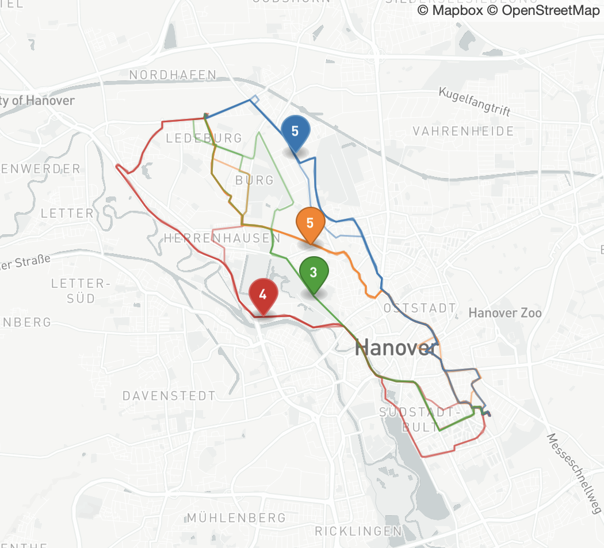

# Analysing the Influence of Route Choice on Traffic Flow with Speed Profiles

## Abstract

The GPS trajectories of test vehicles are used to compare the influence of route choice on the travel time between a
common origin and destination. The speed profiles are used to calculate the stop duration at traffic lights and the fuel
consumption per vehicles. These performance indicators are compared between two groups of vehicles following the route
advice of load balanced routing (NUNAV Navigation) and individualistic routing without balancing (Google Maps). In both
cases live traffic information was used. The results show improved average travel times for the distribution of travel
demand across multiple paths during demand spikes.

## Introduction

Floating car data (FCD) provides access to intrinsic properties of the traffic system such as the vehicle velocity.
Compared to road-side infrastructure FCD provides a high spatial resolution and coverage on the level of individual road
segments. It can be recorded by commodity mobile phones at a temporal resolution of 1 sample per second. This sampling
rate enables the calculation of speed and acceleration profiles which can be used to evaluate fuel consumption and
emissions per vehicle [[1](https://github.com/movsim/movsim)].

Automotive travel in urban areas is dominated by congestion at bottlenecks as for instance traffic signals. Intelligent
infrastructure adapts the timing of traffic signals to the travel demand to improve traffic flow. On the other hand, the
existing capacity of the infrastructure can be used more efficiently by distributing the travel demand on the road
network. Especially in high demand scenarios the prevention of congestion leads to significant travel time gains.
Simulations demonstrated a travel time reduction as the travel demand was shifted by a dynamic toll
[[2](https://hal.archives-ouvertes.fr/hal-00591847/)].

## Load balanced routing

The load balanced routing service which is used in the following is described in more detail in [3] and is only
summarised here. The road network is represented as a mathematical graph for the path finding algorithm. Each road
segment is assigned a cost which can be for example the average travel time. The cost is updated in real time with live
traffic data. After calculating and returning a route the routing service stores a timed reservation for each road
segment. When calculating a route, the impact of the additional vehicles on the travel time is predicted from the number
of reservations by utilising the fundamental relations of traffic flow. As the mathematical graph stores information on
the participants, it allows them to communicate with each other during route calculation like an intelligent swarm. Due
to the capacity-dependent increase in travel time the travel demand is distributed across alternative paths with similar
travel time.

## Test drive setup

In the city of Hanover, Germany an artificial demand spike was created by sending 39 vehicles from the same origin to a
common destination during the evening rush hour. The trajectories and speed profiles of the floating cars were recorded
to measure the real-word effect of route choice on floating cars in a high demand scenario. The vehicles were split in
two groups with 22 and 17 vehicles respectively. In each group the drivers were following the route guidance by a mobile
navigation app. The first group was using Google Maps which has a good live traffic coverage in Hanover (individualistic
routing) while the second group was following the route advice of NUNAV Navigation with live traffic data and load
balanced routing. The two groups started interleaved on a supermarket parking lot. Origin and destination have been
chosen such that the vehicles must cross the city centre and without a motorway nearby which usually would be the
preferable choice.

## Data acquisition

Several hardware solutions exist for vehicle tracking via GPS receivers. Aftermarket modules for the on-board
diagnostics (OBD) port can be easily installed and are commonly used for fleet management. However, the typical position
update interval is 10 s and the device stops transmitting when the vehicle is waiting at a traffic light. On the other
hand, commodity mobile phones are equipped with GPS hardware and provide position updates on 1 s intervals. The higher
temporal resolution improves the stop detection at traffic lights and allows to calculate acceleration profiles from the
GPS trajectories. The data presented in this work was recorded by mobile phones and transmitted via the cell network to
a central server.

## Results

The key performance indicators are summarised in table 1. The values are given per vehicle as the mean over all
vehicles. For each GPS trajectory the travel time between start and finish location was derived from the GPS timestamps.
The travel distance was measured after matching the GPS trajectories to the road geometry from Open Street
Map [[4](https://www.openstreetmap.org/about)]. The average speed is calculated from travel time and distance.
A stop is detected when the vehicle speed is below 5 km/h and the stop period ends when the speed is above 10 km/h.
The durations of all stops are summarised per vehicle. Additionally,
the fuel consumption for a typical gasoline car has been simulated for the GPS trajectories using the multi-model
open-source vehicular-traffic simulator (MovSim) [[1](https://github.com/movsim/movsim)].

**Table 1:** Mean performance indicators per vehicle

| Route choice    | Vehicles | Distance | Travel time | Speed     | Stops    | Fuel    |
|-----------------|----------|----------|-------------|-----------|----------|---------|
| Individualistic | 22       | 10.5 km  | 34.4 min    | 18.5 km/h | 14.8 min | 1.068 l |
| Load balanced   | 17       | 11.1 km  | 30.6 min    | 22.0 km/h | 10.7 min | 1.048 l |

 

**Figure 1:** Route choice, left: individualistic routing, right: load balanced routing  
The labels indicate the number of vehicles on the marked path. The origin is in the southeast and the destination is in
the northwest.

The stop duration contributes significantly to the travel time. As shown in figure 1 the vehicles following load
balanced routing are spreading out over the road network and different intersections. The lower travel time compared to
the individualistic route choice can be contributed to shorter stops at traffic lights. The map shows a variety of paths
and the different choices for the middle part are compared in table 2. The second half of the red path uses a dual
carriage way. Thus, it has the highest average speed and fuel consumption. Additionally, the stop duration correlates
with the volume of consumed fuel as the modelled gasoline car keep the engine running when waiting. There is not a
single best path. However, according to the aggregated KPIs in table 1 it is beneficial to distribute the demand across
multiple paths.

**Table 2:** Mean performance indicators per vehicle for each path

| Route choice    | Path   | Vehicles | Distance | Travel time | Speed     | Stops    | Fuel    |
|-----------------|--------|----------|----------|-------------|-----------|----------|---------|
| Individualistic | Orange | 20       | 10.5 km  | 34.8 min    | 18.4 km/h | 15.1 min | 1.077 l |
| Individualistic | Blue   | 2        | 10.2 km  | 30.7 min    | 19.8 km/h | 12.0 min | 0.979 l |
| Load balanced   | Red    | 4        | 12.9 km  | 27.9 min    | 27.8 km/h | 9.2 min  | 1.134 l |
| Load balanced   | Green  | 3        | 10.9 km  | 33.1 min    | 19.9 km/h | 11.9 min | 1.045 l |
| Load balanced   | Orange | 5        | 10.4 km  | 31.3 min    | 20.0 km/h | 10.9 min | 1.002 l |
| Load balanced   | Blue   | 5        | 10.5 km  | 30.5 min    | 20.8 km/h | 11.0 min | 1.028 l |

## Conclusion

The route choice has a significant influence on traffic flow. Even a good live traffic data coverage can not prevent
congestion as the routing engine can only react after vehicles are slowing down. Individualistic routing is not using
the road network efficiently because additional vehicles are assigned to a road segment until it becomes congested. Some
cities aim to improve efficiency with a demand-based city toll to shift the travel demand towards the system optimum.
The presented results show that a similar effect can be achieved by load balanced routing which includes the dynamic
cost in the path finding algorithm without the need for a real-world toll.

## Acknowledgments

Author: [Jonas Matthias](https://github.com/jonasmatthias)

This work was enabled by colleagues across several teams at Graphmasters. I would like to thank everyone involved in the
real world experiment. Special thanks to:

- Philip Griggs: Simulation of route choices in the routing backend
- Alexander Schacher and Florian Herzog: GPS data acquisition on mobile devices
- Karsten Klompmaker and Peter Finch: Data transfer and aggregation
- Jannik Vogel: Data visualisation and statistics
- Matthias Pastunink, Jasmin Schönberger and Jil Baae: Organisation of test drivers and vehicles
- And the ADAC Niedersachsen/Sachsen-Anhalt e. V. for fruitful discussions and organising the event

## References

1. Treiber, M., A. Kesting, C. Thiemann. "How much does traffic congestion increase fuel con-sumption and emissions?
   Applying a fuel consumption model to the NGSIM trajectory data." In 87th Annual Meeting of the Transportation
   Research Board, Washington, DC, vol. 71, pp. 1-18. 2008. https://github.com/movsim/movsim
2. Leurent, F., T. P. Nguyen (2010). Network optimization with dynamic traffic information and tolling: a probabilistic
   model and economic analysis. 12th World Conference on Transport
   Research. https://hal.archives-ouvertes.fr/hal-00591847/
3. Matthias, J. (2021). Traffic flow optimisation with load-balanced routing and targeted traffic strategies. In
   Proceedings 27th World Congress on ITS, Hamburg. ERTICO (ITS Europe).
4. OpenStreetMap. https://www.openstreetmap.org/about
